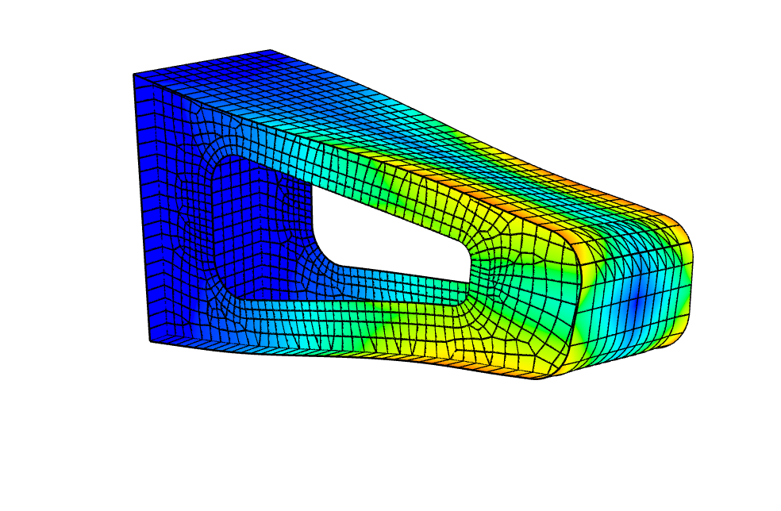
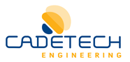

femgl
=====
A WebGL accelerated finite element mesh viewer.



# Usage
To launch the application, go to the following URL:

https://mikolalysenko.github.io/femgl/index.html

Custom meshes may be inspected by dragging a file onto the page.

## Preparing data

To translate existing data into the web format a conversion script is provided which is written in python (see `convert/convert.py`).  Some example data is contained in the `data/` folder of this repository and a demonstration of how to convert this can be found in `convert/example.py`.

# Mesh schema

Each mesh is a JSON object consisting of coordinate data, displacements, elements and palette information.  The mesh JSON object must have the following properties:

#### `coordinates`
An array of length 3 arrays storing the coordinates of each node in the mesh.

#### `displacements`
An array of length 3 arrays giving the displacement of each node in the mesh.

#### `elements`
An array of groups of elements.  Each element group is a JSON object with the following properties:

##### `type`
The type of the element.  Currently only the following element types are supported:

* `P6` A parabolic triangular element
* `P8` A parabolic quadrilateral element

##### `stresses`
An array of per-element stress values

##### `cells`
An array of arrays giving the vertex indices for each cell in the mesh.

#### `palette`
An array of length 3 arrays giving the palette texture in RGB color space.

# Building locally

First, you will need to clone this repo and then install all of its dependencies:

```
git clone git@github.com:mikolalysenko/femgl.git
cd femgl
npm install
```

After this is done you can then run the program locally using budo via the following command:

```
npm start
```

Or build a standalone page with the command:

```
npm run build-page
```

# Credits

Development supported by



(c) 2017 BITS Cooperative, CADETECH S.A.
